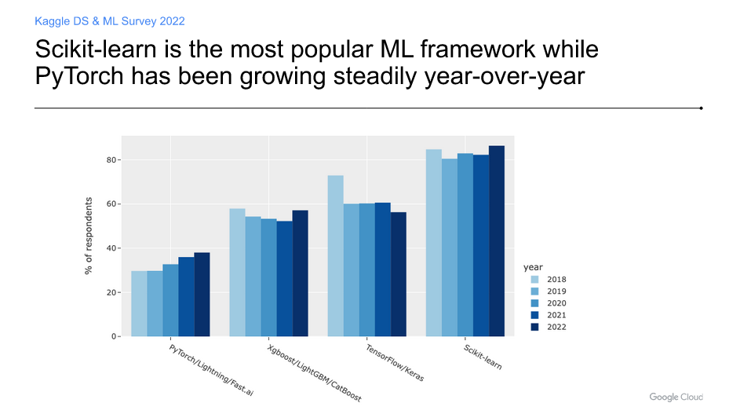

# Machine Learning frameworks in Python

1. [**TensorFlow**](https://www.tensorflow.org/):

- Developed by Google Brain, TensorFlow is an open-source machine learning framework widely used for both research and production purposes.
- It provides comprehensive support for deep learning and neural networks.
- Based on Javascript
- Open Source and has extensive APIs
- Runs on CPUs and GPUs
- It provides extensive, flexible features, an exhaustive library for programming, classifications, regression models, neural networks, including a suite to write algorithms for software.

2. [**PyTorch**](https://pytorch.org/):

- Developed by Facebook's AI Research lab (FAIR), PyTorch is another popular open-source machine learning library known for its dynamic computation graph and ease of use.
- It's widely used in research and also gaining traction in production environments.
- Supports cloud-based software development
- Suitable for designing neural networks and Natural Language Processing
- Good for designing computational graphs
- Compatible with Numba and Cython
- The PyTorch machine learning framework, based on Torch and Caffe2, comes with loads of options for optimizing algorithms.
- It is perfectly suited to design neural networks using the Autograd Module and Natural Language Processing.
- PyTorch is open-source and supports cloud-based software development.
- It comes with multiple features, including libraries, tools, and distributed training.
- For User Interface development, it supports Lua.
- Pytorch is used by Meta and IBM.
- Good for designing computational graphs, its front end development is hybrid, which makes for versatile usability.
- The platform was designed to be integrated with Python and compatible with libraries such as Numba and Cython.

3. [**scikit-learn**](https://scikit-learn.org/stable/user_guide.html):

- scikit-learn is a simple and efficient tool for data mining and data analysis, built on NumPy, SciPy, and matplotlib.
- It provides simple and efficient tools for data mining and data analysis and is widely used for classical machine learning algorithms like classification, regression, clustering, and dimensionality reduction.
- Also free and open-source
- Beginner friendly and comes with detailed documentation.
- It permits developers to change any pre-set parameters for algorithms when in use or during run-time.
- The framework is well suited for unsupervised and administrative calculations.

4. [**Keras**](https://keras.io/):

- Keras is an open-source neural network library written in Python.
- It's designed to enable fast experimentation with deep neural networks and runs on top of TensorFlow, Theano, or Microsoft Cognitive Toolkit (CNTK).
- Keras provides a high-level API for building and training neural networks.

5. [**XGBoost/LightGBM/CatBoost**](https://xgboost.readthedocs.io/en/stable/):

- These are gradient boosting libraries that are highly efficient and widely used for structured/tabular data.
- They often outperform other algorithms in Kaggle competitions and are widely used in industry for tasks like regression, classification, and ranking.

6. [**MXNet**](https://mxnet.apache.org/versions/1.9.1/):

- Developed by Apache Software Foundation, MXNet is a flexible and efficient deep learning library with APIs available in multiple programming languages.
- It's known for its scalability and performance.
- Suitable for large-scale, multi-dimensional or sparse data sets
- Microsoft-owned CNTK is used to describe neural networks as a sequence of computational development steps in the form of directed graphs.
- It is an open-source ML framework designed with algorithms in C++ programming language and production readers.
- CNTK is an ideal choice for large-scale, multi-dimensional, or sparse data sets from C++, Python, and BrainScript.
- It allows developers to merge and view various ML model types, which includes recurrent networks, feed-forward deep neural networks, and convolutional neural networks.

7. [**Hugging Face Transformers**](https://huggingface.co/docs/transformers/index):

- This library provides state-of-the-art natural language processing (NLP) architectures (like BERT, GPT, etc.) and pretrained models.
- It's widely used for tasks such as text classification, sentiment analysis, question answering, and more.

8. [**CNTK (Microsoft Cognitive Toolkit)**](https://learn.microsoft.com/es-es/cognitive-toolkit/):

- Developed by Microsoft, CNTK is an open-source deep learning toolkit for commercial-grade distributed deep learning.
- It offers efficient implementations of several algorithms and is known for its scalability across multiple GPUs and servers.

9. **Spark MLlib**: MLlib is Apache Spark's scalable machine learning library. It provides scalable implementations of many common machine learning algorithms and tools for feature extraction, transformation, dimensionality reduction, and more.

10. **Fastai**: Fastai is a high-level deep learning library built on top of PyTorch. It aims to make deep learning more accessible through high-level abstractions and best practices.

11. **Theano**:

- Built on NumPy, Theano is a dynamic Machine Learning framework with a powerful interface, similar to the NumPy library. It is useful for manipulating and evaluating various mathematical expressions. Using Theano with GPU delivers faster results as it can compute 140 times faster on a GPU than a CPU.
- Theano helps to build efficient Machine Learning algorithms. It offers faster and stable monitoring of the most complicated variables.

12. **NLTK**:

- Also known as the Natural Language ToolKit, NLTK is used by a Python web development company to integrate Natural Language Processing. The tool is useful for Deep Learning solutions that require high amounts of text and speech processing.
- NLTK works well with FrameNet, WordNet, and Word2Vec for proper language processing. It also offers keyword search, optimization of tokens, voice recognition, and much more to ensure solutions that provide language capabilities work well.

13. **Sonnet**:

- It is a high-level library designed to perform operations using neural network structures in TensorFlow. It assists with the creation of primary Python objects that relate to a specific part of the neural network. It simplifies the design of the neural network, ensuring developers get the best results out of the process.
- Sonnet divides the modules into submodules or can pass to other modules during the internal process. Sonnet Machine Learning models can be easily integrated with TensorFlow code and other high-level libraries.

14. [**Shogun**](https://github.com/shogun-toolbox/shogun?tab=readme-ov-file):

- Open-source and free
- It is useful for developers who want to design algorithms and data structures specifically for problems in the fields of education and research. Shogun can also connect with other ML libraries, including LibLinear, LibSVM, SVMLight, LibOCAS, among several others.
- it helps implement Hidden Markov models, process large volumes of data, is user friendly, and provides several flexible features and functionalities.

15. [**H2O.ai**](https://h2o.ai/)

- H2O is an open-source ML framework developed to cater to organizations in their **decision support system processes**. H2O is widely deployed for risk and fraud propensity analytics, insurance customer analytics, patient analytics in healthcare, advertising spend and ROI, and customer intelligence.
- Integrates with Hadoop and Spark
- H2O-3 delivers implementations of many popular algorithms such as GBM, Random Forest, Deep Neural Networks, Word2Vec, and Stacked Ensembles.
- H2O-3 is highly versatile and extensible, and developers can append data transformations and add customized algorithms of their preference, while having access to all client systems.
- Data collection is fairly easy, but decision making is tough.
- H2O-3 is for just that, and it makes it quick and easy to help derive insights from voluminous data through quicker and more accurate predictive models.

16. [**Apple Core ML**](https://developer.apple.com/machine-learning/core-ml/)

- Developed for the IOS ecosystem.
- Beginner friendly.
- Core ML is very comprehensive and provides a plethora of features such as image classification, sentence classification, natural language processing, barcode detection, a Gameplay Kit, and object tracking.
- Convert models from third-party training libraries into Core ML using the coremltools Python package.
- Build and train Core ML models right on your Mac with no code.
- With its unique low-level tech stack, it can provide excellent performance through the utilization of both CPUs and GPUs.
- Concerning security and ease of use, Core ML ensures user privacy and functionality of the app even in offline mode.

| Library                            | Main Use Cases                                        | Advantages                                                   | Disadvantages                                                      | When to Use?                                                                                                                                                                                                |
| ---------------------------------- | ----------------------------------------------------- | ------------------------------------------------------------ | ------------------------------------------------------------------ | ----------------------------------------------------------------------------------------------------------------------------------------------------------------------------------------------------------- |
| TensorFlow                         | Deep learning, neural networks, production deployment | Scalability, production readiness, extensive community       | Steeper learning curve, verbose syntax, complex debugging          | When building large-scale deep learning models for production deployment, especially in industries like healthcare or finance where model reliability is crucial.                                           |
| PyTorch                            | Deep learning, research, dynamic computation graph    | Flexibility, dynamic computation graph, Pythonic             | Less production-ready, smaller community compared to TensorFlow    | When experimenting with new neural network architectures, conducting research, or developing prototype models due to its dynamic computation graph and Pythonic syntax.                                     |
| Scikit-learn                       | Classical machine learning, data preprocessing        | Simplicity, extensive documentation, ease of use             | Limited support for deep learning, scalability concerns            | When working with traditional machine learning tasks such as classification, regression, or clustering on small to medium-sized datasets.                                                                   |
| Keras                              | Simplified deep learning, prototyping                 | User-friendly API, high-level abstraction, rapid prototyping | Limited customization, less suitable for advanced research         | When rapidly prototyping deep learning models or building simple to moderately complex neural networks without needing extensive customization.                                                             |
| XGBoost                            | Supervised learning, gradient boosting                | High performance, scalability, flexibility                   | Requires fine-tuning, limited support for deep learning            | When dealing with structured/tabular data and aiming for high predictive accuracy, particularly in scenarios like financial forecasting or fraud detection.                                                 |
| MXNet                              | Deep learning, neural networks, scalability           | Scalability, flexibility, support for multiple languages     | Steeper learning curve, smaller community compared to TensorFlow   | When scalability and flexibility are critical, especially in environments where deploying models across various platforms and languages is necessary.                                                       |
| Hugging Face Transformers          | Natural language processing, transformer-based models | Pretrained models, easy integration, extensive repository    | Limited support for non-NLP tasks, performance constraints         | When working on natural language processing tasks, particularly utilizing transformer-based models such as BERT, GPT, or T5 for tasks like text classification, language generation, or sentiment analysis. |
| CNTK (Microsoft Cognitive Toolkit) | Deep learning, neural networks                        | High performance, scalability, production readiness          | Complex syntax, limited community support                          | When prioritizing performance and scalability in deep learning projects, especially in Microsoft-centric environments.                                                                                      |
| Spark MLlib                        | Big data processing, distributed machine learning     | Scalability, integration with Apache Spark                   | Limited support for deep learning, steep learning curve            | When working with big data and requiring distributed machine learning capabilities, especially in Apache Spark environments.                                                                                |
| Fastai                             | Deep learning, education, fast experimentation        | Simplicity, high-level abstractions, rapid prototyping       | Less control over low-level details, limited scalability           | When learning deep learning concepts, conducting educational projects, or rapidly iterating on model ideas, particularly for practitioners new to deep learning.                                            |
| Theano                             | Deep learning, neural networks                        | Efficiency, flexibility, numerical stability                 | Maintenance mode, decreasing community support                     | When seeking efficiency and numerical stability in deep learning models, especially in research environments where custom model implementations are required.                                               |
| NLTK                               | Natural language processing, text analysis            | Extensive tools for text processing, educational resources   | Performance bottlenecks for large datasets, outdated in some areas | When working on text processing tasks such as tokenization, stemming, or part-of-speech tagging in educational or research projects.                                                                        |
| Sonnet                             | Deep learning, neural networks                        | Integration with TensorFlow, modular design                  | Limited community, specific to TensorFlow ecosystem                | When building neural networks within TensorFlow projects and requiring a modular design approach for better code organization and maintainability.                                                          |

Sources:

1. https://hackr.io/blog/machine-learning-frameworks
2. https://www.coursera.org/articles/python-machine-learning-library
3. https://neptune.ai/blog/most-used-tools-frameworks-and-libraries-in-machine-learning-industry-roundup
4. https://www.projectpro.io/article/machine-learning-frameworks/509
5. https://www.botreetechnologies.com/blog/top-python-frameworks-for-machine-learning-and-deep-learning/
6. https://medium.com/bitgrit-data-science-publication/top-machine-learning-frameworks-used-by-data-scientists-47ab9a273c95
7. https://intellipaat.com/blog/machine-learning-frameworks/
